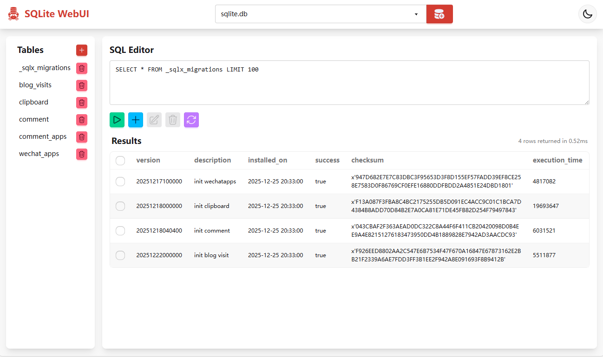

<div align="center">
  </img>
  <p><strong>Rust SQLite WebUI - A extreme lightweight SQLite Web administration tool</strong></p>
  
  English | [简体中文](README_CN.md)
  
</div>


# SQLite WebUI

A extreme lightweight SQLite Web administration tool based on Rust (Axum) and Solid.js.

- 🐳 **Extreme Lightweight**: Docker image size is only **~10MB**.
- ⚡ **High Performance**: Runtime memory usage is only **~1MB**.
- 🤖 **AI Assistant**: Intelligently corrects wrong SQL, supports natural language to SQL conversion.




## Tech Stack

- **Backend**: Rust, Axum, SQLx, Tokio
- **Frontend**: Solid.js, Vite, TailwindCSS, DaisyUI

## Usage

Recommend using Docker to run this application.

### Docker Run

```bash
docker run -d \
  -p 3000:3000 \
  -v sqlite.db:/app/db/sqlite.db \
  -e API_KEY=your_secret_key \
  --name sqlite-webui \
  wangyucode/rust-sqlite-webui
```

### Docker Compose

```yaml
version: '3'
services:
  sqlite-webui:
    image: wangyucode/rust-sqlite-webui
    ports:
      - "3000:3000"
    volumes:
      - sqlite.db:/app/db/sqlite.db
    environment:
      - API_KEY=your_secret_key
```

### Configuration

- **DB files**: it will list the SQLite database files in the `/app/db/` directory. so just mount the dbs to `/app/db/` directory.

- **Environment Variables**:
| Variable | Default | Description |
| --- | --- | --- |
| API_KEY | `your-super-secure-key` | Authentication key for accessing the WebUI. |
| RUST_LOG | `rust_sqlite_webui=debug,tower_http=debug` | Logging level configuration. |
| OPENAI_API_KEY | - | OpenAI API key (required for AI assistant). |
| OPENAI_BASE_URL | `https://api.openai.com/v1` | OpenAI API base URL. |
| OPENAI_MODEL | `gpt-5.4-mini` | OpenAI model name. |

> **Tip**: For development, create a `.env` file in `backend/` directory to configure these variables.

## Development

### 1. Start Frontend Development Server

Node.js (v18+) is required.

```bash
cd frontend
pnpm install
pnpm start
```

The frontend service runs at `http://localhost:5173` by default.

### 2. Start Backend API Service

Rust (cargo) is required.

```bash
cd backend
cargo run
```

The backend service runs at `http://localhost:3000`.

### 3. Build for Release

**Build Frontend**:
```bash
cd frontend
pnpm build
```
The build artifacts are located in `frontend/dist`.

**Build Backend**:
```bash
cd backend
cargo build --release
```

The release binary is located in `backend/target/release`.

## Documentation

For detailed design documentation, please refer to [doc/design.md](doc/design.md).
