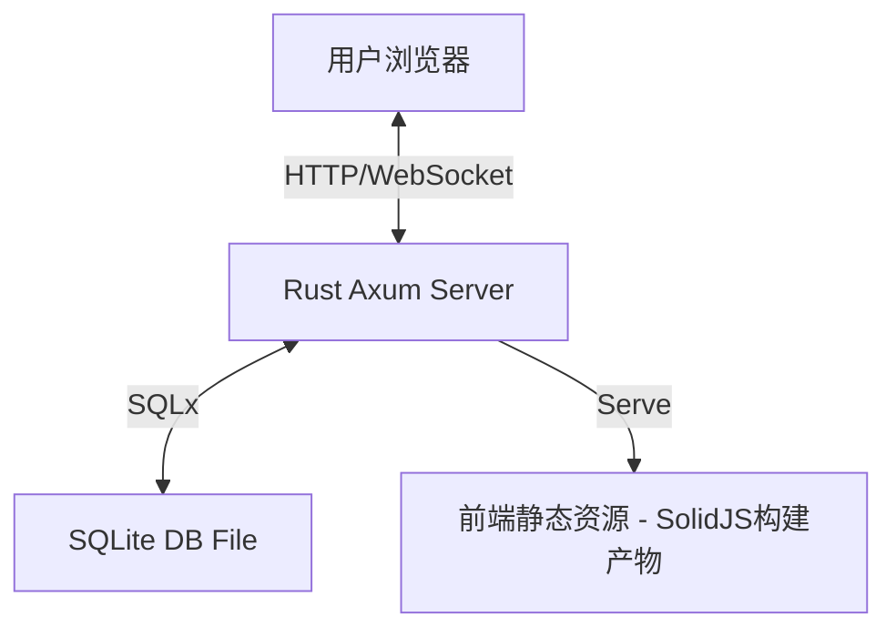

[English](design.md) | [简体中文]

# SQLite WebUI 设计方案

## 1. 项目概述

本项目旨在构建一个基于 Rust + SolidJS 的 SQLite 数据库管理工具，追求极致的简洁与轻量。用户可以通过浏览器直接管理本地的 SQLite 数据库文件，执行 SQL 查询，查看和编辑数据。

**核心目标**:
- **轻量级**: 单二进制文件分发，启动即用。Docker 镜像仅 **~6.5MB**。
- **高性能**: 运行时内存占用仅 **~700KB**。能够流畅处理大量数据的展示。
- **简洁易用**: UI 设计基于 "Less is More" 原则，专注于核心 SQL 操作。

## 2. 技术栈架构 (方案 A)

### 2.1 后端 (Rust)
- **Web 框架**: `Axum` - 高性能、人体工学极佳的异步 Web 框架。
- **运行时**: `Tokio` - Rust 异步生态的标准。
- **数据库交互**: `SQLx` - 纯 Rust 实现的异步 SQL 驱动，支持连接池。
- **序列化**: `Serde` + `Serde JSON` - 处理前后端数据交换。

### 2.2 前端 (Modern Web)
- **框架**: `Solid.js` - 高性能响应式框架，无虚拟 DOM。
- **构建工具**: `Vite` - 极速开发服务器和构建工具。
- **UI 框架**: `TailwindCSS` + `DaisyUI` - 实用优先的 CSS 框架及语义化组件库。

## 3. 系统架构设计

### 3.1 整体架构
采用前后端分离架构，但在生产环境中，前端静态资源将嵌入到 Rust 二进制文件中，通过 Axum 提供的 Static File 服务进行分发，实现“单文件部署”。



### 3.2 目录结构规划
```text
rust-sqlite-webui/
├── backend/            # 后端源码 (Rust)
│   ├── Cargo.toml
│   └── src/
│       ├── main.rs     # 入口与路由
│       ├── state.rs    # 全局状态
│       └── handlers/   # API 处理器
│           ├── mod.rs
│           ├── connection.rs
│           ├── query.rs
│           └── health.rs
├── frontend/           # 前端源码 (SolidJS)
│   ├── package.json
│   ├── vite.config.ts
│   └── src/
│       ├── App.tsx     # 根组件
│       ├── lib/        # 逻辑与 API 客户端
│       └── components/ # UI 组件
└── doc/                # 文档
```

## 4. 核心功能模块与 API 设计

### 4.1 连接管理
管理 SQLite 数据库连接。
- **API**:
  - `POST /api/connect`: 连接到本地 SQLite 文件。
    - **Request**: `{ "path": "test.db", "create": true }`
  - `GET /api/db-files`: 列出 `./db` 目录下的可用数据库文件。
  - `GET /api/health`: 健康检查。

### 4.2 数据库元数据
用于展示数据库结构。
- **API**:
  - `GET /api/tables`: 获取当前连接中的所有表名。

### 4.3 SQL 执行器
核心功能，用于执行用户输入的 SQL。
- **API**:
  - `POST /api/query`: 执行 SQL 语句。
    - **Request**: `{ "sql": "SELECT * FROM users LIMIT 100" }`
    - **Response**: 
      ```json
      {
        "columns": ["id", "name"],
        "column_types": ["INTEGER", "TEXT"],
        "rows": [[1, "Alice"], [2, "Bob"]],
        "affected_rows": null,
        "execution_time": 12.5,
        "error": null
      }
      ```

### 4.4 API 安全
实施了基本的安全措施以保护接口。
- **认证**: 所有 API 请求（除健康检查外）都需要 `x-api-key` 请求头。
  - 密钥通过 `API_KEY` 环境变量设置。
  - 默认值: `your-super-secure-key`。
- **文件访问控制**: 数据库文件仅限于 `./db` 目录。已阻止目录遍历（例如 `../`）。

## 5. UI/UX 设计草图

界面布局采用经典的 **单页面布局**：

*   **Header**: 顶部栏，包含 Logo、当前数据库路径，支持下拉框选择历史连接、新建数据库按钮。
*   **Sidebar (左侧)**: 数据库对象浏览器。
    *   **Tables**: 列表展示所有表名，每个表名旁有删除按钮。
    *   **Add Table**: 按钮用于添加新表。
    *   点击表名可以生成 `SELECT` 语句并快速预览数据。
*   **Main Content (右侧)**: 选项卡式工作区。
    *   **SQL Editor**: 简单的文本区域，用于输入 SQL 语句。
    *   **Tool Bar**: 工具栏，包括执行SQL，选中行之后的增删改查操作。
    *   **Table Data Tab**: 纯表格浏览模式，支持简单的排序和过滤。

**主题风格**:
- 默认跟随系统深色/浅色模式。
- 使用 DaisyUI 的 `light` 和 `dark` 主题。
- 强调色使用 Rust 的官方橙色。